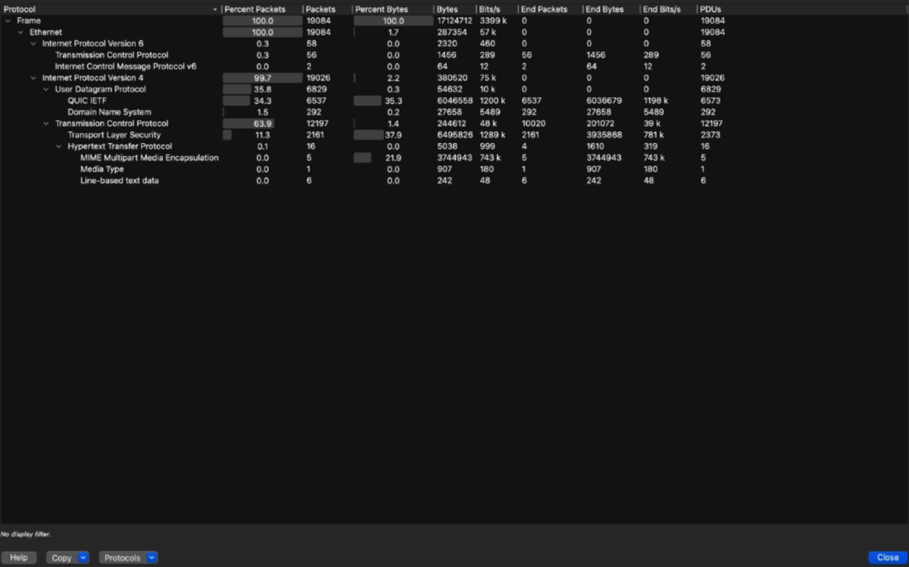
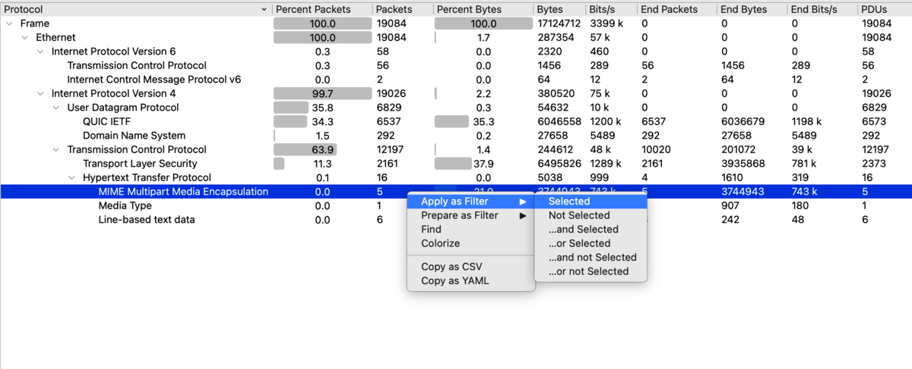
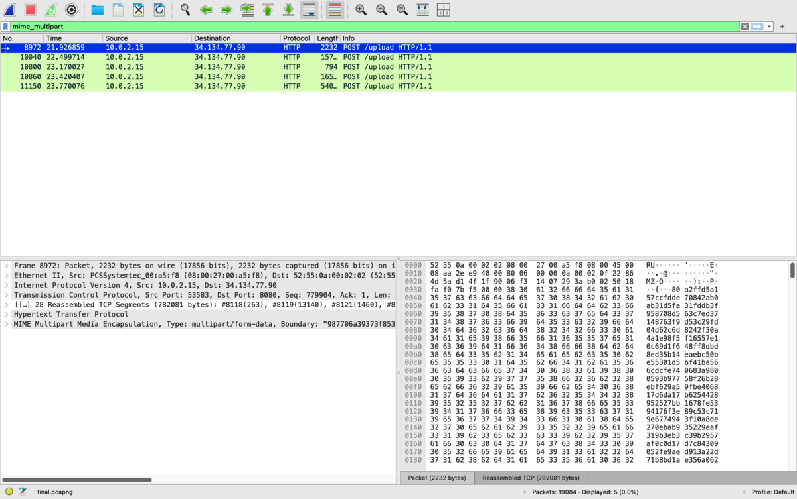
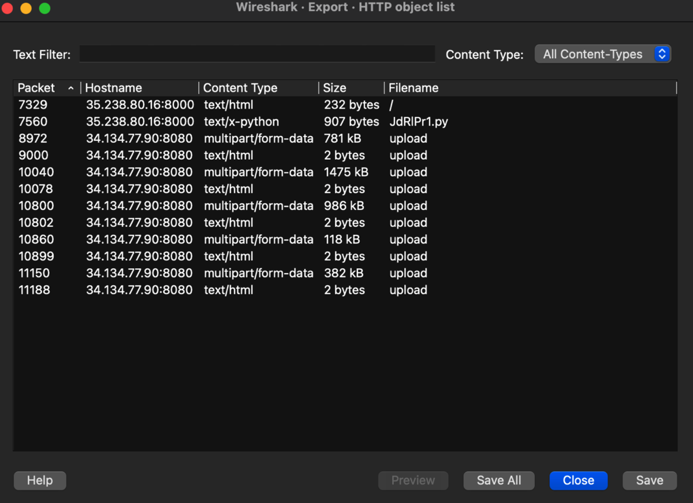
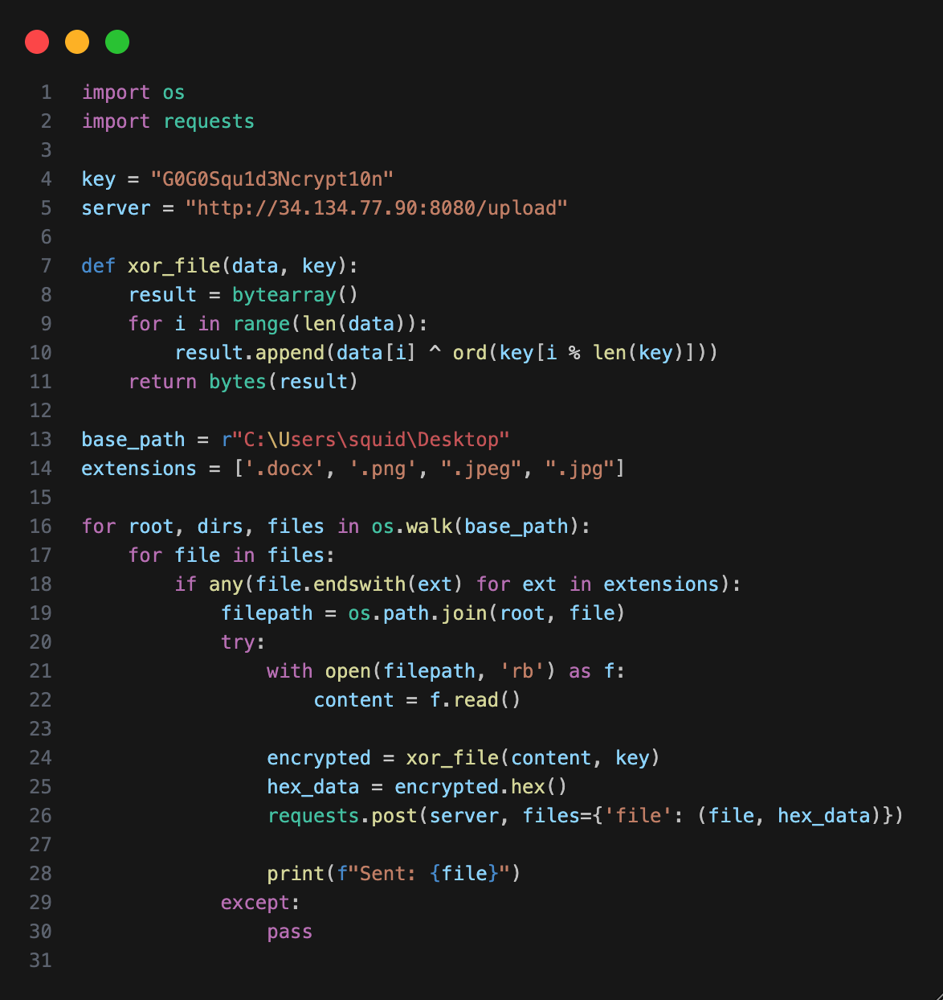
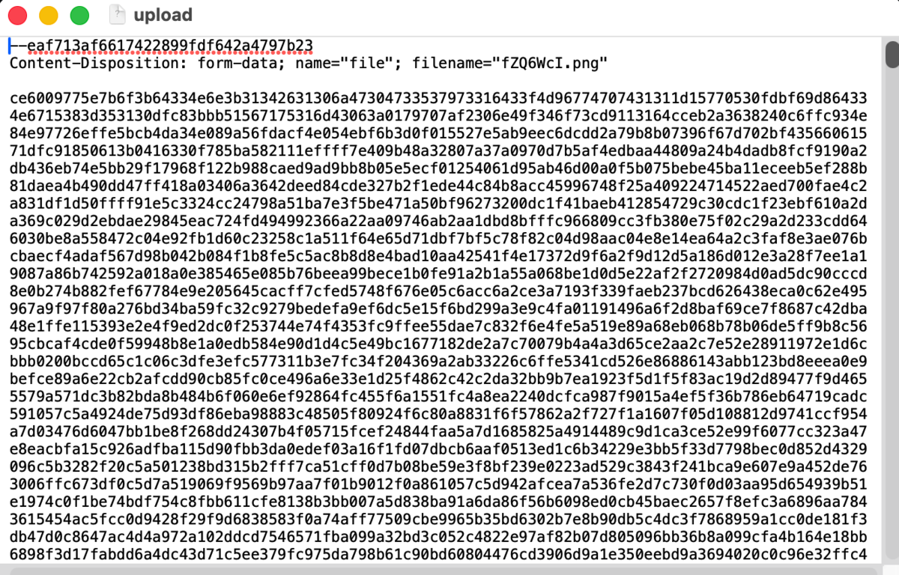
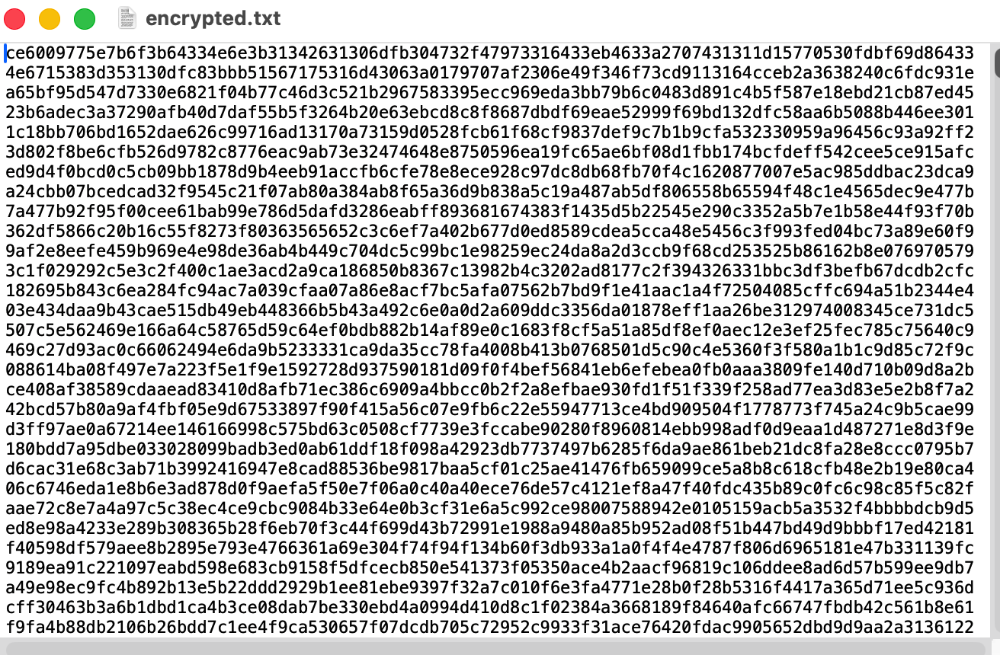

### Challenge Name

Team K&K Network Forensics Challenge

Author: UofTCTF 2026

### Description

This challenge involves analyzing a `.pcapng` packet capture file to investigate suspicious network activity. The scenario describes a team fearing data theft by a competitor. The goal is to analyze the network logs, identify the exfiltrated data, and uncover the flag hidden within the stolen files.

### The Idea

The core concept of this challenge is **Data Exfiltration via HTTP**. The attacker used a custom Python script to encrypt confidential files on the victim's machine and upload them to an external server. By analyzing the network traffic, we can identify the large file uploads, recover the attacker's script to understand the encryption method (XOR), and write a counter-script to decrypt the stolen data and reveal the flag.

---

### Step by step solution

#### Step 1: Initial Reconnaissance (Wireshark)

We started by opening the `.pcapng` file in Wireshark. To filter through the noise and understand the general traffic flow, we navigated to `Statistics > Protocol Hierarchy`.

This provided a high-level view of all protocols present. A specific line stood out immediately: **MIME Multipart Media Encapsulation** which is a method used to combine multiple types of data (text, images, audio, etc.) into a single message for transmission over the internet, most commonly in email. It accounted for nearly **22%** of the total byte count, despite being involved in only a few packets. This disproportionate size is a strong indicator of a file transfer. Specifically, files being sent via HTTP POST requests.

{ loading=lazy }
#### Step 2: Locating the Exfiltration

Instead of manually searching for the suspicious traffic, we used the Protocol Hierarchy window to filter it directly. 

We right-clicked on the **MIME Multipart Media Encapsulation** row and selected **Apply as Filter > Selected**. This immediately isolated the specific packets responsible for the heavy data transfer.

{ loading=lazy }

This filter revealed a series of **HTTP POST** requests sent to the IP address `34.134.77.90`. By looking at the Info column, we saw they were targeting the URI `/upload`, confirming that data was being actively exfiltrated to an external server.

{ loading=lazy }

#### Step 3: Extracting Evidence

To retrieve the actual data being sent, we used Wireshark's built-in file extraction tool:

- Navigate to: `File > Export Objects > HTTP`
    

This opened a list of all files transferred over HTTP. Two items were critical:

1. **`JdR1Pr1.py`**: A Python script (likely the malware itself).
    
2. **`upload`**: Several entries named "upload", mostly with the MIME type `multipart/form-data`. One file was significantly large (**1475 kB**), and others were smaller (e.g., **118 kB**, **382 kB**).
    

{ loading=lazy }

We saved the script and all instances of the "upload" files to our local machine for analysis.

#### Step 4: Malware Analysis

We examined the content of the extracted script `JdR1Pr1.py`. It revealed the exact logic used to steal the data:

```Python
key = "G0G0Squ1d3Ncrypt10n"
# ...
def xor_file(data, key):
    result = bytearray()
    for i in range(len(data)):
        result.append(data[i] ^ ord(key[i % len(key)]))
    return bytes(result)
```

The malware scans the victim's desktop for files (`.docx`, `.png`, `.jpg`), encrypts them using **XOR** with the key `"G0G0Squ1d3Ncrypt10n"`, converts the encrypted bytes to a hex string, and uploads them.

{ loading=lazy }

#### Step 5: Decryption & Solving

To retrieve the original files, we wrote a Python solver script to reverse the process. The script needed to:

1. Read the `upload` file.
    
2. Clean the file (remove HTTP headers and newlines using Regex) to isolate the hex payload.
    
3. Convert the hex back to bytes.
    
4. XOR the bytes with the key to decrypt.


{ loading=lazy }

{ loading=lazy }

**The Solver Script (`solve.py`):**

```Python
import re

# Configuration
key = "G0G0Squ1d3Ncrypt10n"
input_file = "encrypted.txt" # The cleaned upload file
output_file = "flag.png"

def xor_decrypt(hex_data, key):
    # Regex to keep ONLY valid hex characters (0-9, a-f)
    clean_hex = re.sub(r'[^0-9a-fA-F]', '', hex_data)
    
    # Ensure even length
    if len(clean_hex) % 2 != 0:
        clean_hex = clean_hex[:-1]

    encrypted_bytes = bytes.fromhex(clean_hex)
    
    result = bytearray()
    for i in range(len(encrypted_bytes)):
        result.append(encrypted_bytes[i] ^ ord(key[i % len(key)]))
    return bytes(result)

with open(input_file, 'r', errors='ignore') as f:
    content = f.read()

decrypted_data = xor_decrypt(content, key)

with open(output_file, 'wb') as f:
    f.write(decrypted_data)
print("Decryption complete.")
```

#### Step 6: The Flag

We initially decrypted the largest file, which turned out to be the victim's desktop background (a distraction). 
{ loading=lazy }

We then targeted the smaller **118 kB** upload file, suspecting it might be the flag. Still it wasn't, so we went through some others by running the script on these files until found a valid PNG image containing the flag.

{ loading=lazy }
